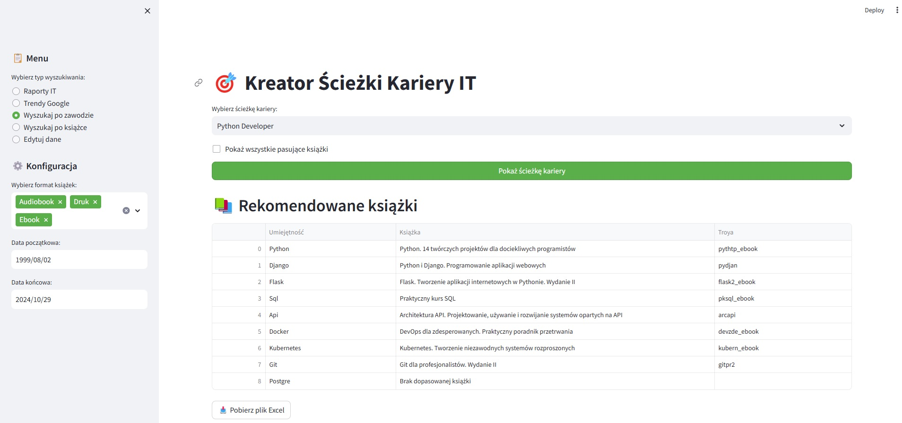
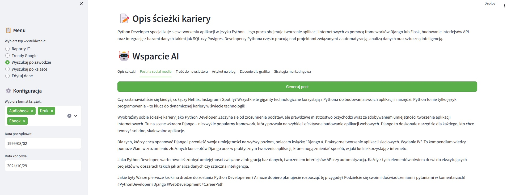
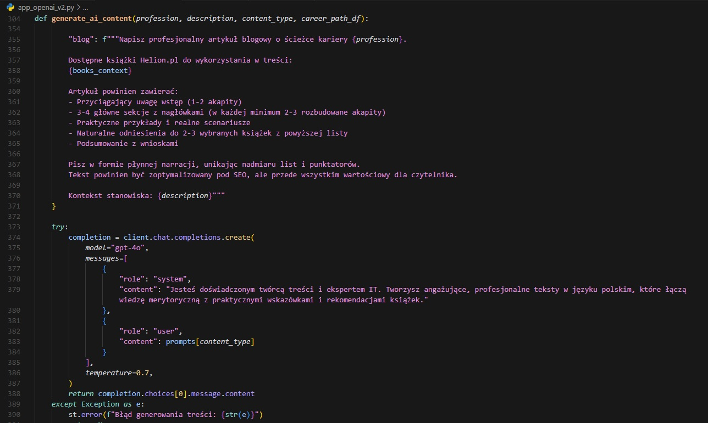
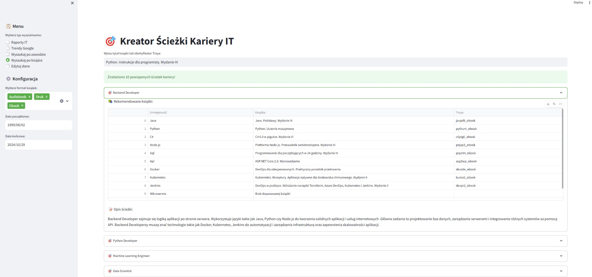

# Kreator Ścieżki Kariery IT

Aplikacja umożliwiająca wybór zawodu w branży IT, prezentująca ścieżkę wymaganych umiejętności oraz sugerująca odpowiednie książki z oferty wydawnictwa Helion, które wspierają rozwój tych kompetencji.

## Funkcjonalności

- Wyszukiwanie i rekomendowanie książek po wybranej ścieżce kariery/zawodzie w branży IT



- Generowanie strategii marketingowej, postów na social media, treści newsletterowych oraz postów blogowych
  we wsparciu z OpenAI API, na podstawie otrzymywanych rekomendacji książek





- Wyszukiwanie ścieżek kariery na podstawie wybranej książki



- Analiza trendów popularności technologii (Google Trends)
- Raporty branżowe w NotebookLM
- Filtrowanie wyników po:
  - Formacie książek (Ebook, Druk, Audiobook)
  - Dacie wydania
- Eksport wyników do CSV
- Wizualizacja dostępności książek dla wymaganych umiejętności
- Edycja danych źródłowych

## Technologie

- Python 3.9
- Streamlit
- Pandas
- Plotly
- PyTrends
- OpenPyXL

## Struktura projektu

```
career-path-app/
├── app.py              # Główny plik aplikacji
├── requirements.txt    # Lista wymaganych pakietów
├── .streamlit/        # Konfiguracja Streamlit
│   └── config.toml
└── data/              # Pliki z danymi
    ├── lista_ksiazek_pl_HELION_all_formats-2.xlsx
    └── Rozszerzona_lista_zawodow_i_technologii_z_jezykami_programowania-UPDATED2.xlsx
```

## Autor

[Robson2k7](https://github.com/Robson2k7)

## Licencja

Copyright (c) 2024 Robson2k7. Wszelkie prawa zastrzeżone.

Ten projekt jest własnością prywatną. Kod źródłowy i dokumentacja są udostępnione wyłącznie do wglądu.
Zabronione jest:
- Kopiowanie i rozpowszechnianie kodu
- Modyfikowanie kodu
- Komercyjne wykorzystanie
- Używanie kodu lub jego części w innych projektach bez pisemnej zgody autora.

---------------------------------------------------------------------------------------------------------------

# IT Career Path Creator

An application that allows users to choose a profession in the IT industry, presents the required skill path, and suggests appropriate books from Helion's catalog to support the development of these competencies.

## Features

- Search and recommendations system for books by selected career path/profession in IT Industry
- Generate marketing strategies, social media posts, newsletter content, and blog posts with the support of the OpenAI API, based on received book recommendations
- Search for career paths based on a selected book
- Analyze technology popularity trends (Google Trends)
- IT industry reports in NotebookLM
- Filter results by:
  - Book format (Ebook, Print, Audiobook)
  - Publication date
- Export results to CSV
- Visualize the availability of books for required skills
- Edit source data

## Technologies

- Python 3.9
- Streamlit
- Pandas
- Plotly
- PyTrends
- OpenPyXL

## Project structure

```
career-path-app/
├── app.py              # Main application file
├── requirements.txt    # List of required packages
├── .streamlit/        # Streamlit configuration
│   └── config.toml
└── data/              # Data files
    ├── lista_ksiazek_pl_HELION_all_formats-2.xlsx
    └── Rozszerzona_lista_zawodow_i_technologii_z_jezykami_programowania-UPDATED2.xlsx
```

## Author

[Robson2k7](https://github.com/Robson2k7)

## License

Copyright (c) 2024 Robson2k7. All rights reserved.

This project is private property. The source code and documentation are provided for viewing purposes only.
The following actions are prohibited:
- Copying and distributing the code
- Modifying the code
- Commercial use
- Using the code or any part of it in other projects without the written consent of the author.
